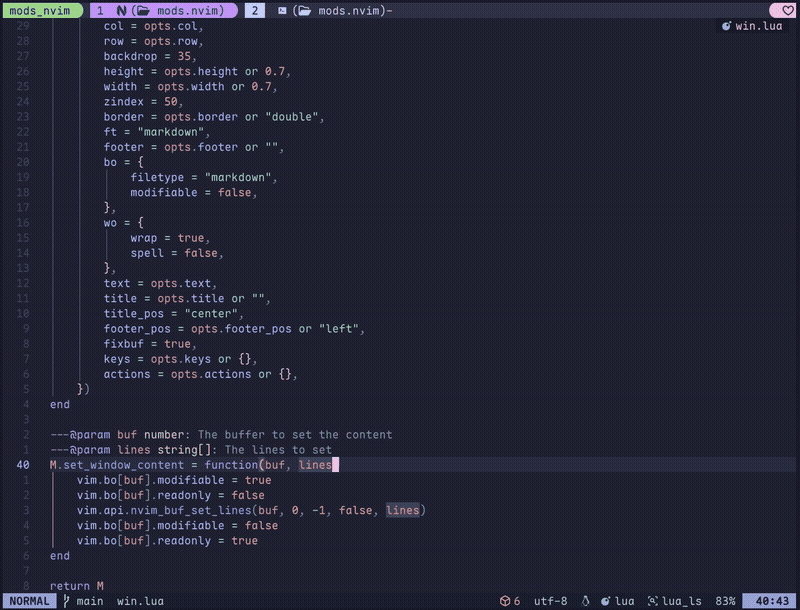

# mods.nvim

If you use [mods](https://github.com/charmbracelet/mods) in your terminal for
AI queries, and if you use Neovim,
this plugin might be interesting to you. It is simply a way to call mods
from within Neovim and get some quick actions like highlighting code in
the editor and asking AI a question about it.



## Installation

### [lazy.nvim](https://github.com/folke/lazy.nvim)

```lua
{
    'ntawileh/mods.nvim'
    dependencies = { "folke/snacks.nvim" },
}
```

## Usage

### Query
```lua
require("mods").query({
    -- optional, defaults to current buffer
    bufnr = 0,
    -- optional, defaults to false. If true,
    -- no content from the buffer will be passed in the prompt
    exclude_context = false,
    -- optional, defaults to false. If true,
    -- will continue previous conversation if it exists
    continue = false,
})
```

This will prompt you to select a prompt and then query mods with the selected prompt.

In Normal mode, the entire buffer will be passed in as context
(unless you set `exclude_context` to true).
In Visual mode, only the selected text will be passed in as context.

If you set `continue` to true, the plugin will try to continue the previous
conversation with that file if it exists.


### Open Conversation
```lua
require("mods").get_history()
```

This will open a floating window with the conversation history for the current file.


### Keymaps

My keymaps to use this plugin are:

```lua

vim.keymap.set({ "v" }, "<leader>aa", function()
    require("mods").query({})
end, {
    desc = "Query Mods AI with selection as context",
})

vim.keymap.set({ "n" }, "<leader>aa", function()
    require("mods").query({})
end, {
    desc = "Query Mods AI with current buffer as context",
})

vim.keymap.set({ "n" }, "<leader>aq", function()
    require("mods").query({
        exclude_context = true,
    })
end, {
    desc = "Query Mods AI without any buffer context",
})

vim.keymap.set({ "n" }, "<leader>ac", function()
    require("mods").get_history()
end, {
    desc = "View AI recent conversation for this file",
})

```

## Configuration

You can call the `setup` function to add more prompts. By default, the plugin
includes the prompts to _Explain_, _Code Review_, _Optimize_, and _Summarize_
the code/selection. You can find details on all the included prompts  
[here](lua/mods/prompts.lua).

You can also set the model to use.  This model has to be defined in your
`mods.yml`.  If you don't set a model, the default one will be used.

```lua

require("mods").setup({
  model = "gpt-4",
  prompts = {
         {
             name = "Caveman Explanation",
             prompt = "Explain the following code snippet to a caveman",
         },
     },
 })
```

## Credits

Have to credit [tjdevries](https://github.com/tjdevries) for the great Advent of
Neovim videos, which taught me lua and Neovim plugin development.

Also, thanks to the creators of [mods](https://github.com/charmbracelet/mods)
for building a very cool AI tool!
